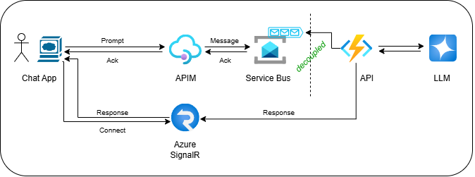
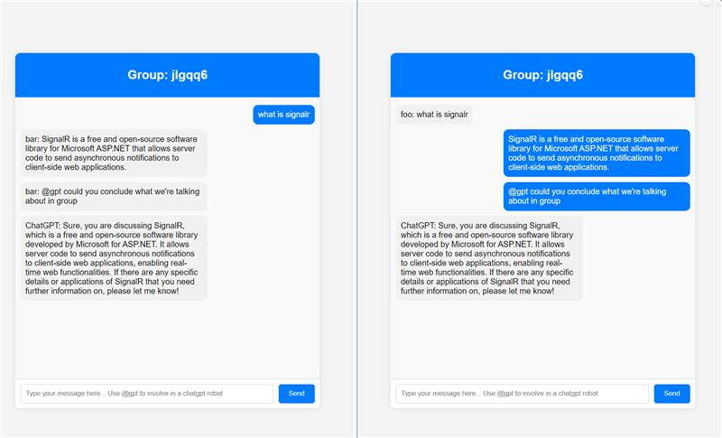

# Async AI Chat Solution

This repo contains a sample for implementing asynchronous, decoupled communication with a Large Language Model (LLM) for systems that need to scale to many concurrent users.

## Scenario
Let's assume you have implemented the following architecture: a desktop app or SPA chat client is sending requests (incl. a natural language prompt from the user) to an API exposed in Azure via API Management (APIM). The API itself can be hosted using different services like Azure Functions, AKS, Container Apps, etc. The API component accesses a large language model (LLM) to retrieve a response for the user's prompt. All calls/connections are made synchronously.

**Note:** The scenario is intentionally kept simple for the purposes of this sample. It can obviously be much more complicated, with the 'API' consisting of one or multiple collaborating agents, talking to multiple (different) LLMS, that can be base or reasoning models. 

## Challenge
Due to the nature of LLMs and also the introduction of advanced capabilities like retrieval augmented generation, multi-agent orchestration, etc., the end-to-end response time might be significant and easily be in the range of double-digits seconds. Also, if the system has to handle complex prompts or if you are using reasoning models, overall latency might be fairly high.

Now, imagine your app is going viral, more and more users are using it, so a large number of concurrent requests (e.g. hundreds of requests per second) are hitting the APIM layer: this would potentially lead to a lot of synchronous requests having to stay open for many, many seconds. This will most likely lead to typical issues seen in synchronous designs when operated at scale: SNAT port/socket exhaustion, timeouts, connection pool saturation, etc. 

**Long story short**: long‑running synchronous calls are an anti-pattern, specifically when used at scale.

## Solution
The way to tackle this is to decouple components by using asynchronicity and messaging. In order to avoid UI clients having to keep HTTP connections to APIM open for a long time, we can implement a pattern where clients just 'hand off' their request and 'wait' in an intelligent way for the response.

### Hand off request
An easy way to do that in APIM is to implement a policy that takes the request coming from the client and passes it as a message into an Azure Service Bus (SB) queue. As soon as SB has persisted the message (and ACKed it back to APIM), APIM sends an 'HTTP 201 Created' response back to the client (where the user can potentially continue to do stuff, as the UI thread is not freezing 🙂).

TODO: _include reference to policy snippet_

### Work on request
Now, a scalable worker component running in Azure Functions, Container Apps, AKS, etc. pulls the message from the queue and starts processing in the backend. In our simple scenario that's just an asynchronous call to an Azure OpenAI endpoint to retrieve an LLM response for the user's prompt. 

**Note:** This processing step can obviously be a much more complex procedure (RAG, multi-agent collaboration, etc.) and might involve even more layers of decoupling/messaging. But let's keep it with a single layer of decoupling for now and observe the effect this already has on latency & scale.

### Pass back response
So, how do we deliver the response back to the UI client, as the initial call has returned immediately after the message has been passed to Azure Servce Bus, and that connection has been closed?
Well, why not use a fully managed Azure Service like [Azure SignalR](https://learn.microsoft.com/en-us/azure/azure-signalr/signalr-overview) that has been built specifically for that scenario: pushing content to connected clients at scale, without the client having to poll.
The service is designed for large-scale, real-time applications and has been tested to handle millions of client connections.

### Approach
The picture below shows our revised approach:

Potentially, we can now connect thousands and thousands of clients at the same time and let them send requests, without running into the issues described above. The interesting piece is: you don't actually have to change too much of your existing code (well, obviously that depends on what you already have and where you're coming from). 

In order to demonstrate that, this repo shows a revised version for one of the canoncial SignalR Chat examples, see [Build an AI-powered group chat with Azure SignalR and OpenAI Completion API](https://learn.microsoft.com/en-us/azure/azure-signalr/signalr-tutorial-group-chat-with-openai) and the associated [GitHub repo](https://github.com/aspnet/AzureSignalR-samples/tree/main/samples/AIStreaming).

The app implements a SignalR group chat with ChatGPT integration, see below.

## Deployment 

...
