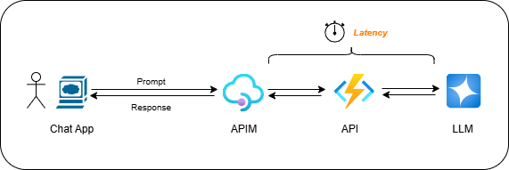

# Async AI Chat Solution

This repo contains a sample for implementing asynchronous, decoupled communication with a Large Language Model (LLM) for systems that need to scale to many concurrent users.

## Scenario
Let's assume you have implemented the following architecture: a desktop app or SPA chat client is sending requests (incl. a natural language prompt from the user) to an API exposed in Azure via API Management (APIM). The API itself can be hosted using different services like Azure Functions, AKS, Container Apps, etc. The API component accesses a large language model (LLM) to retrieve a response for the user's prompt. All calls/connections are made synchronously.

**Note:** The scenario is intentionally kept simple for the purposes of this sample. It can obviously be much more complicated, with the 'API' consisting of one or multiple collaborating agents, talking to multiple (different) LLMS, that can be base or reasoning models. 

## Challenge
Due to the nature of LLMs and also the introduction of advanced capabilities like retrieval augmented generation, multi-agent orchestration, etc., the end-to-end response time might be significant and easily be in the range of double-digits seconds. Also, if the system has to handle complex prompts or if you are using reasoning models, overall latency might be fairly high.

Now, imagine your app is going viral, more and more users are using it, so a large number of concurrent requests (e.g. hundreds of requests per second) are hitting the APIM layer: this would potentially lead to a lot of synchronous requests having to stay open for many, many seconds. This will most likely lead to typical issues seen in synchronous designs when operated at scale: SNAT port/socket exhaustion, timeouts, connection pool saturation, etc. 

**Long story short**: long‑running synchronous calls are an anti-pattern, specifically when used at scale.

## Solution
The best way to tackle this is to decouple the  

## Deployment 

...
