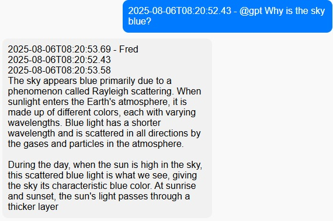

# Changes to the Original Chat Sample

This repo is based on the the canoncial SignalR Group Chat example, see [Build an AI-powered group chat with Azure SignalR and OpenAI Completion API](https://learn.microsoft.com/en-us/azure/azure-signalr/signalr-tutorial-group-chat-with-openai) and the associated [GitHub repo](https://github.com/aspnet/AzureSignalR-samples/tree/main/samples/AIStreaming).

Changes to the original sample are documented here. These changes are made to support many concurrent client connections to the AI chat application. The following chapters describe the connections and communication flow between the components in the architecture.

## Client to Azure SignalR
The client connects to an Azure SignalR endpoint using a connection string that is stored in the web app hosting the hub, see ```joinGroupWithName``` in [scripts.js](./src/Client/scripts.js). It keeps the connection open, if possible via a WebSocket. This connection will be used to pass back the response for the prompts the user submits.

The client sets up an event handler for the `message` event, which is triggered when a new message is received from the SignalR hub. The message is then displayed in the chat UI, see `bindConnectionMessages` in [scripts.js](./src/Client/scripts.js).

## Client to Azure API Management (APIM)
Instead of sending the chat request directly to a SignalR endpoint (as in the original repo), the client sends it to an Azure API Management (APIM) endpoint, see the ```SendMessage``` function in [scripts.js](./src/Client/scripts.js).

The payload looks like this:

```json
{
  "userName": "Fred",
  "groupName": "TestGroup",
  "message": "@gpt What do you know about async programming?",
  "timestamp": "2025-08-05T12:34:56Z"
}
```

The call is protected by an APIM subscription key, which is passed in the request header as `Ocp-Apim-Subscription-Key`. The key is retrieved at runtime from an ```/api/config``` endpoint in the web app (taken from server configuration) that also hosts the SignalR hub.

## APIM to Azure Service Bus (SB)
The API Management instance receives the request and forwards it on to an Azure Service Bus (SB) queue. This is done using a policy that takes the incoming request and sends it as a message to the SB queue directly. The message body contains the original request payload. 

```xml
<authentication-managed-identity resource="https://servicebus.azure.net" output-token-variable-name="msi-access-token" ignore-error="false" />
        <set-header name="Authorization" exists-action="override">
            <value>@((string)context.Variables["msi-access-token"])</value>
        </set-header>
        <set-body>@(context.Request.Body.As<string>())</set-body>
        <set-backend-service base-url="https://{{serviceBusNamespace}}.servicebus.windows.net/{{queue}}/messages?api-version=2015-01" />
```

Authentication is done via the System Identity of APIM that has send permissions configured on the SB queue. The SB namespace and queue name are configured as named values in APIM.

As soon as the message has been acknowledged by Service Bus, APIM returns a ```201 Created``` response to the client, which can go on and release the UI thread. The response to the prompt will be sent back to the client via the SignalR connection.

## Azure Functions to Service Bus
Azure Functions are triggered by messages in the Service Bus queue. Messages are retrieved in batches from the queue and processed in parallel in multiple Function instances. 

Batch size and concurrency can be configured in the [`host.json`](./src/Function/host.json) file of the Function app. Instance size, scale-out settings (always-ready & maximum instances) can be configured in the Azure portal or via the CLI. Potentially, the Azure Function can be hosted in a Flex Consumption or in a Premium Plan.

The `ProcessMessage` function in [ServiceBusQueueTrigger.cs](./src/Function/ServiceBusQueueTrigger.cs) retrieves a single message from the queue and processes it. 

***Note:*** The function could also pick up a batch of messages from the queue and process them in parallel. This might be required for achieving even more scale and throughput, depending on the number of concurrent users and the expected message volume. Check out the docs for [Azure Functions and Service Bus](https://learn.microsoft.com/en-us/azure/azure-functions/functions-bindings-service-bus-trigger?tabs=csharp) for more details on how to configure batch size and concurrency.

## Azure Functions to SignalR
Processing in the Function consists of the following steps:

- Deserializing the message.
- Checking if the message text starts with "@gpt", which means it is a request for the GPT model.
  - if not, just return the message text to the SignalR chat group, including a current timestamp.
  - if yes, call the configured Azure OpenAI LLM endpoint with the user's prompt to get a response and return the response to the chat group, including a current timestamp.

The client receives the response via the SignalR connection and displays it in the chat UI.
The output field contains 3 timestamps:
  1. Time when the chat client outputs the message
  2. Time when the chat client sent the message to APIM
  3. Time when the Function sent the message to SignalR



These timestamps help understand the latency of the end-to-end process. The tests showed that, even under load, latency is not significantly different from the latency of the standalone model request, as this is usually in the range of multiple seconds already.

If you want to check out how to test the scenario go [here](./tests.md).
