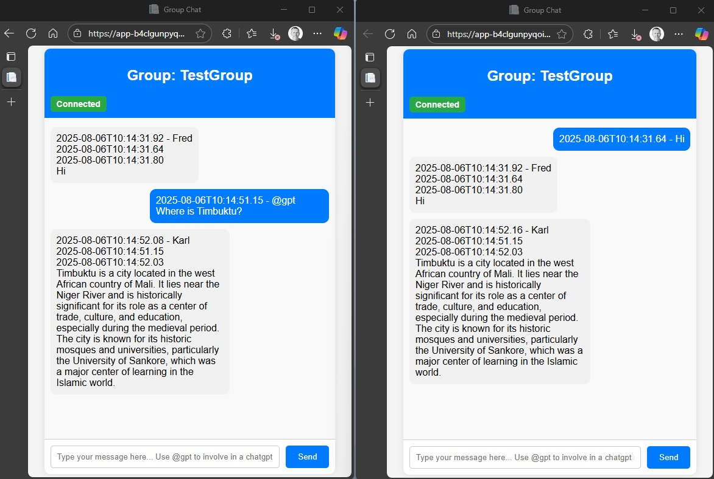
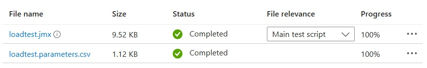
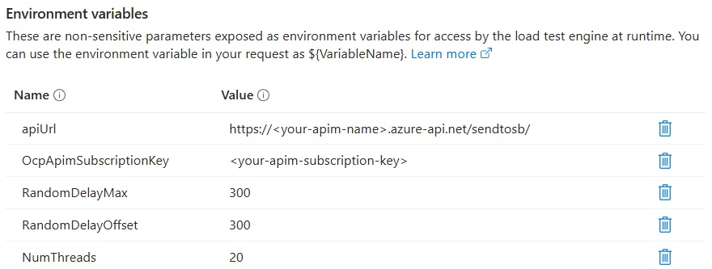
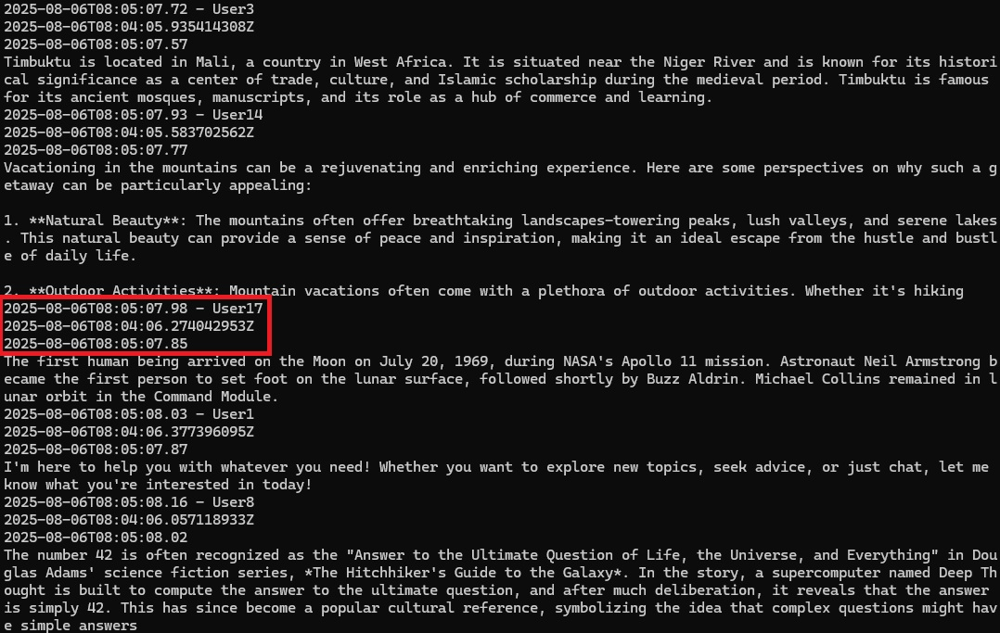
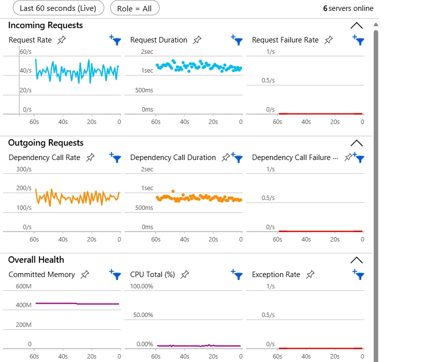

# Testing the Revised Chat Sample

## Simple Test

You can do a simple test by deploying the solution (see [here](./README.md#getting-started)), fire up the client app and send a @gpt message, which will trigger the asynchronous processing flow and return a response from the GPT model via SignalR. You can also open a second browser tab, connect to the same chat group and send a message there. You should see the response from the GPT model in both tabs.

If you have deployed the solution into Azure, you can use the Azure Portal to monitor the various components and their interactions, see [below](#monitoring-in-azure-portal).

## Load Test

If you want to do a more comprehensive load test, you can leverage the resources in the [`LoadTest`](./src/LoadTest/) folder. It contains a JMeter script and associated test data file that can be run standalone or using Azure Load Testing. For general instructions on how to run the load test in Azure, check out the [docs](https://learn.microsoft.com/en-us/azure/load-testing/how-to-create-and-run-load-test-with-jmeter-script).

When you create the test in your Azure Load Testing instance, select JMeter as the framework and upload the JMeter script and test data file: 

Configure the test parameters for the JMeter script as in the example below:

Make sure to use the proper values for your environment, specifically for APIM. For the random delay and thread parameters please check out the JMeter documentation.

## Test Results
### Monitoring in Test Client
In order to check latency for the client requests sent during the load test, there is a console client in the [`TestClient`](./src/TestClient/) folder. Configure your SignalR endpoint in the `appsettings.json` file and run it. When asked, connect to the `TestGroup`chat group that is also used by the JMeter test data. 

When you run the load test, the test client will print out all responses, because (for testing purposes) ALL messages are sent back to the same group. This allows checking out latency by looking at the three timestamps that the client dumps out:

  1. Time when the chat client outputs the message
  2. Time when the chat client sent the message to APIM
  3. Time when the Function sent the message to SignalR

### Monitoring in Azure Portal
In the Azure Portal, you can monitor the various components of your solution and their interactions. For example, you can open the App Insights instance and go to 'investigate' -> 'Live Metrics' to see the incoming requests and their processing times. 

The image below shows one of the test runs with an average throughput of ~40 requests per second. Latency of the end-to-end calls wasn't significantly different from the latency of standalone model requests.

## Troubleshooting
You will need to play with the testing parameters (e.g., RandomDelayMax, RandomDelayOffset, NumThreads) for the load test to find the right balance. 

For the Azure Function, Premium Plan might be an option to go much higher in terms of throughput and scale. You can also configure the Function to pick up messages from Service Bus in batches and process multiple messages in parallel.

Check the live metrics in App Insights and logs of the Azure Function to see if there are any errors.

Make sure to provision enough quota (TPM - tokens per minute) on your Azure OpenAI resource. If that's not high enough your load test calls will get throttled (HTTP 429 errors). In that case, the Function will return an error string, which the test client will print out in red color. 

***In case you encounter any issues, please submit a PR to this repo.***
