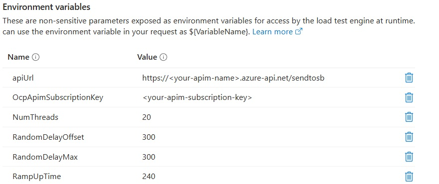

# Testing the Revised Chat Sample

## Simple Test

You can do a simple test by deploying the solution (see [here](./README.md#getting-started)), fire up the client app and send a @gpt message, which will trigger the asynchronous processing flow and return a response from the GPT model via SignalR. You can also open a second browser tab, connect to the same chat group and send a message there. You should see the response from the GPT model in both tabs.


If you have deployed the solution into Azure, you can use the Azure Portal to monitor the various components and their interactions, see [below](#monitoring-in-azure-portal).

## Load Test
### Configuration
If you want to do a more comprehensive load test, you can leverage the resources in the [`LoadTest`](./src/LoadTest/) folder. It contains a JMeter script and associated test data file that can be run standalone or using Azure Load Testing. For general instructions on how to run the load test in Azure, check out the [docs](https://learn.microsoft.com/en-us/azure/load-testing/how-to-create-and-run-load-test-with-jmeter-script).

When you create the test in your Azure Load Testing instance, select JMeter as the framework and upload the JMeter script and test data file: 


Configure the test parameters for the JMeter script as in the example below:



Make sure to use the proper values for your environment, specifically for APIM (endpoint & API subscription key). In order to control the load, you can configure the following parameters:

- `RampUpTime`: The time (in seconds) to ramp up the load. This is the time it takes to start all threads. If NumThreads is 20, and the ramp-up time is 240s, then the first thread will start immediately, the second thread will start after 12 seconds, the third thread after 24 seconds, and so on. Ramping up your test iteratively is important to give the backend (Function layer) the chance to autoscale properly.
- `NumThreads`: The number of concurrent threads to use for the load test.
- `RandomDelayOffset`: The constant random delay (in milliseconds) to apply to each request.
- `RandomDelayMax`: The maximum random delay (in milliseconds) to add to the offset. JMeter generates a random number less than or equal to the provided value.

### Monitoring in Test Client
In order to check end-to-end latency for the requests sent during the load test, there is a console client in the [`TestClient`](./src/TestClient/) folder. Configure your web app endpoint in the `appsettings.json` file and run it. When asked, connect to the `TestGroup`chat group that is also used by the JMeter CSV test data file. 

When you run the load test, the test client will print out all responses, because (for testing purposes) ALL messages are sent back to the same chat group. This allows checking out latency by looking at the three timestamps that the client dumps out:

  1. Time when the chat client outputs the response 
  2. Time when the chat client has sent the prompt to APIM
  3. Time when the Function has sent the response to SignalR


### Monitoring in Azure Portal
In the Azure Portal, you can monitor the various components of your solution and their interactions. For example, you can open the App Insights instance and go to 'Investigate' -> 'Live Metrics' to see the incoming requests, throughput, processing times and number of function hosts processing requests.

## Test Results

One of the goals of this sample is to show that the suggested decoupling approach is suitable for use cases where you need high throughput (i.e., many concurrent requests) and your backend requests are long-running at the same time. 

To demonstrate this, I first tested a 'base' scenario, with the Function calling an LLM (gpt-4o-mini) with the prompt, and returning the response immediately (via SignalR), see [here](#base-scenario) for test results.

Then I tested a 'high-throughput, long-running processing' scenario, where the Function first calls the LLM and then simulates further backend processing for a configurable time via an asynchronous Task.Delay() call. Imagine this being a group of agents collaborating on a task, which might take some time. You can see the results of my test runs [here](#high-throughput-scenario).

### Base Scenario
In the base scenario, no delay is configured for the backend, i.e. `DelayInSeconds` in the Function App Settings is set to 0. The Function calls the LLM and returns the response immediately via SignalR. Backend processing times for the simple prompts I used (see [loadtest.parameters.csv](./src/LoadTest/loadtest.parameters.csv)) was around 2-3 seconds. 

I used the Flex Consumption Plan to host the Azure Function, and wanted to see how far this would scale for the base approach. I configured *Dynamic Concurrency* in `host.json`, see [here](https://learn.microsoft.com/en-us/azure/azure-functions/functions-concurrency#dynamic-concurrency-configuration) for details.

You can find the deployment scripts for the base scenario in the `flex-consumption` branch of this repo. 

Testing showed a throughput of up to ~40 requests per second, see image below.


For increased load, the Service Bus queue started to fill up, and the Flex Consumption instances couldn't keep up or scale out fast enough. I didn't dig much deeper into configuration options for Flex Consumption, as I wanted to check out the Premium Plans and longer backend processing times anyway. 

### High Throughput Scenario
In the high-throughput scenario, I configured a delay for the backend, e.g., I set `DelayInSeconds` in the Function App Settings to 10 seconds. This delay is added to the backend processing time, after the function has called the LLM. So, overall backend processing time would be around 12-13 seconds, and I wanted to see end-to-end latency remain stable even under very high load.

I used the Premium Plan to host the Azure Function for this scenario, as it offers better scaling options and performance compared to the Flex Consumption Plan. I deployed a Service Plan with 2 [Always Ready](https://learn.microsoft.com/en-us/azure/azure-functions/functions-premium-plan?tabs=portal#always-ready-instances) EP3 instances.

In `host.json`, I configured the following settings for the [Service Bus trigger](https://learn.microsoft.com/en-us/azure/azure-functions/functions-concurrency) like this:

```json
 "extensions": {
        "serviceBus": {
            "prefetchCount": 512,
            "maxConcurrentCalls": 128,
            "autoCompleteMessages": true
        }
    }
```

I did not change the original Function code, so each function instance just processes a single Service Bus message. The Function Premium engine ensures that the instances can scale out to handle the load. That worked quite nicely. Going even higher in terms of throughput might require processing messages in batches & in parallel per instance, which is supported by the Service Bus trigger. 

You can find the deployment scripts for the high-throughput scenario (incl. deployment of the Premium Plan & `host.json` settings) in the `main` branch of this repo.

I tested up to a throughput of ~120 requests per second, without hitting any issues, see image below. 


The image shows a flat processing time of around 12 seconds, which is the sum of the LLM call and the configured delay in the Function App Settings. Throughput was stable over time, and the Service Bus queue did not fill up, as the Premium Plan instances scaled out to handle the load.

Also my console test client confirmed an end-to-end latency of around 12-14 seconds as well, see below: 


## Troubleshooting
You will need to play with the testing parameters (e.g., `RandomDelayMax`, `RandomDelayOffset`, `NumThreads`) during the load test to find the right mix to achieve your desired throughput.

In order to achieve higher throughput & better scale, Premium Plan is the right option to host your Azure Functions. You can also configure the Function to pick up messages from Service Bus in batches and process multiple messages in parallel. This wasn't necessary in the test scenario described above to achieve a throughput of 100 requests per second with an overall average backend runtime of ~12 seconds.

In all your test runs, you should check the live metrics in App Insights and also the logs of the Azure Function to see if there are any errors.

Make sure to provision enough quota (TPM - tokens per minute) on your Azure OpenAI resource. If that's not high enough, your load test calls will get throttled (HTTP 429 errors). In that case, the Function will return an error string, which the test client will print out in red color. 

***In case you encounter any issues, please submit a PR to this repo.***
